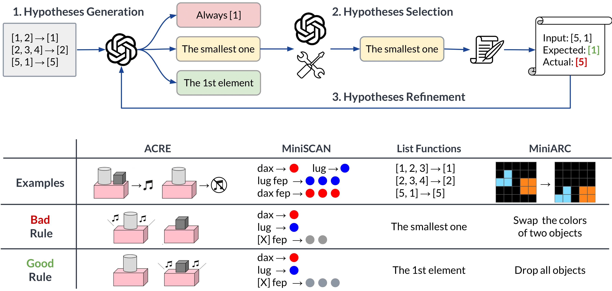

# LLM Inductive Reasoning 

This repository contains code for the paper ["Phenomenal Yet Puzzling: Testing Inductive Reasoning Capabilities of Language Models with Hypothesis Refinement"](https://arxiv.org/abs/2310.08559)
(Linlu Qiu, Liwei Jiang, Ximing Lu, Melanie Sclar, Valentina Pyatkin, Chandra Bhagavatula, Bailin Wang, Yoon Kim, Yejin Choi, Nouha Dziri, Xiang Ren)



## Setup

1. Set up the OpenAI API key and Anthropic API key. Store them in the environment variables `OPENAI_API_KEY` and `ANTHROPIC_API_KEY`.
2. Install the dependencies using 

```bash
pip install -r requirements.txt
```

## Code Structure
- `data`: Data used in our paper.
- `prompts`: Prompt templates for each task.
- `tasks`: Task-specific code.
- `outputs`: Outputs and model interactions for each task. The naming convention follows `{model}_{dataset}_{method}_iter{max_iter}_t{temperature}_n{n}_{rule_type}_{interpreter_type}.json` (see below). The default setting is used if a value is not specified.
- `scripts`: Useful scripts.

## Run Experiments

To rerun our experiments, you'll need access to the relevant APIs. You can also convert our provided output files into a cache file. Our query function will automatically use the cache content without making API calls. You should be able to roughly reproduce all of our experiments this way, except for some experiments where the translated Python programs introduce some randomness. To convert outputs to a cache file, run:

```bash
python scripts/convert_outputs_to_cache.py \
    --output_dir outputs \
    --cache_file outputs/query_cache.pkl
```

All experiments can be run using python run_task.py. You may need to specify the following key arguments:

- `--data_file`: Path to the data JSONL file. The data used in our paper is in `data` directory.
- `--model_name`: Model name, choices=([`gpt-4-0613, gpt-3.5-turbo-0613, claude-2`]).
- `--task_name`: Task name, choices=([`acre, scan, list_function, arc`]).
- `--output_file`: Path for the output JSON filed.
- `--method`: Method, choices=([`rule, io`]).
- `--max_iter`: Maximum number of iterations.
- `--temperature`: Sampling temperature.
- `--n`: Number of outputs per API call, i.e., the number of hypotheses per iteration for rule prompting and the number of predictions for SC prompting.
- `--rule_type`: Representation of hypothesis (see Section 2.2 of the paper).
- `--interpreter_type`: Type of interpreter, choices=([`default, lm`]).
- `--n_train`: Number of seen examples for each task.
- `--n_test`: Number of unseen examples for each task.
- `--cache_file`: Path to the cache file. It should be the same as the one used in `scripts/convert_outputs_to_cache.py`. Default to `${output_dir}/query_cache.pkl` if not specified.
- `--history_file`: Path to the history file that will be used to store the history of interactions with the model. Default to `${output_dir}/history.jsonl` if not specified.

To run experiments using iterative hypothesis refinement:
```bash
python run_task.py --data_file ${data_file} \
    --model_name ${model_name} \
    --task_name ${task} \
    --output_file ${output_file} \
    --max_iter ${iter} --temperature ${t} --n ${n}
```

To run experiments using input-output (IO) prompting:
```bash
python run_task.py --data_file ${data_file} \
    --model_name ${model_name} \
    --task_name ${task} \
    --output_file ${output_file} \
    --method io
```

To run experiments using self-consistency (SC) prompting:
```bash
python run_task.py --data_file ${data_file} \
    --model_name ${model_name} \
    --task_name ${task} \
    --output_file ${output_file} \
    --method io \
    --temperature ${t} --n ${n}
```

To run experiments using Self-Refine (SR):
```bash
python run_task.py --data_file ${data_file} \
    --model_name ${model_name} \
    --task_name ${task} \
    --output_file ${output_file} \
    --max_iter ${iter} --temperature ${t} --n ${n} \
    --rule_type "nl" \
    --interpreter_type "lm"
```

To apply existing induced rules using LMs (see Section 4.1):
```bash
python eval_task.py --data_file ${dta_file} \
    --model_name ${model_name} \
    --task_name ${task} \
    --input_file ${input_file} \
    --output_file ${output_file}
```

## How to Add a New Task
To setup your own task:
1. Convert your data into a JSONL file, with each line representing one example. Each example should follow:
```json
{
    "train": [
        {"input": "input_1", "output": "output_1"},
        {"input": "input_2", "output": "output_2"},
    ],
    "test": [
        {"input": "input_3", "output": "output_3"},
        {"input": "input_4", "output": "output_4"},
    ]
}
```
2. Add your prompt templates into `prompts/${task_name}.py`. You need to define the following prompt templates:
```python
io_prompt = ""
example_prompt = ""
rule_prompt = ""
feedback_prompt = ""
rule_with_feedback_prompt = ""
rule_to_output_prompt = ""
```
3. Add your task to `tasks/${task_name}.py` by inheriting from `Task` in `tasks/base.py`. At a minimum, you need to implement the `apply_all_rules` function. If you use an LM interpreter, this function can simply be `apply_all_rules_with_lm`. If you use a Python interpreter, you can inherit directly from `PythonTask` in `tasks/base.py`.